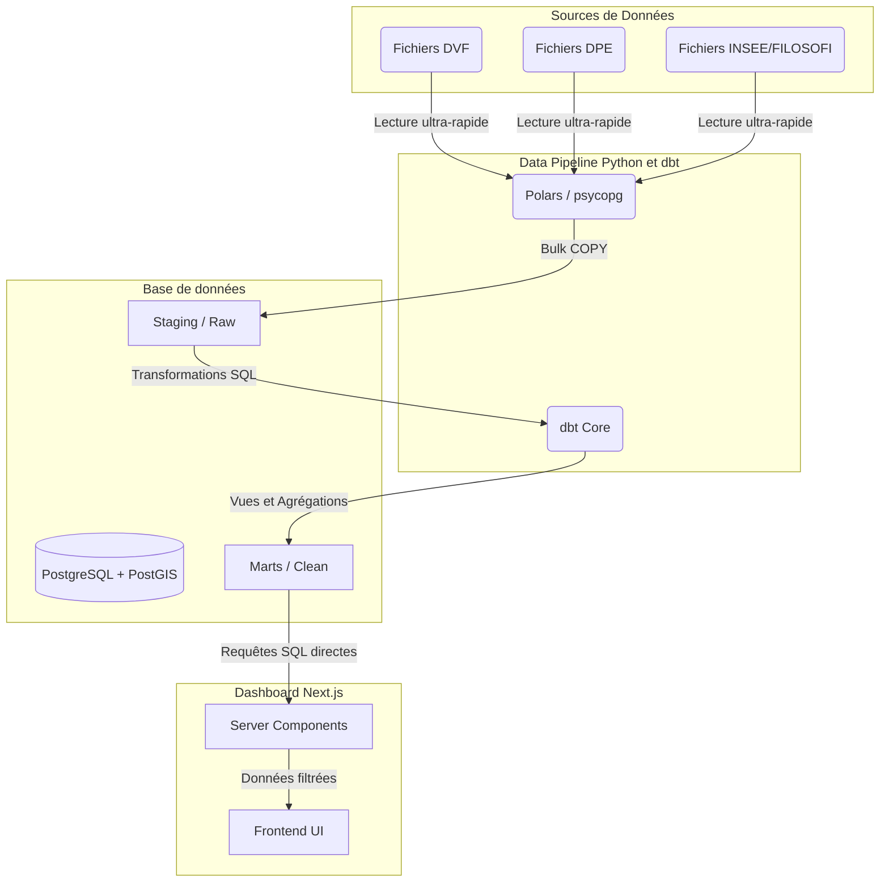

# French Real Estate Market Analysis (SAE 2026)

**Auteurs : Nathan AVENEL et Adrien PINEAU**

Ce projet de Business Intelligence (BI) immobilier permet de répondre à la problématique :
**"Étant donné un prix, une localisation et des caractéristiques, est-ce une bonne affaire immobilière ?"**

## 🏗️ Architecture ELT



## 🚀 Démarrage Rapide

1. **Lancer la base de données (PostgreSQL + PostGIS)** :
   ```bash
   make up
   ```

2. **Ingestion des données brutes (Couche Bronze)** :
   Placez vos CSV dans le dossier `data/` puis exécutez le script d'ingestion :
   ```bash
   make ingest
   ```

3. **Transformation des données (Couche Gold via dbt)** :
   ```bash
   make dbt-run
   ```

4. **Lancer le Frontend Next.js** :
   ```bash
   make dev-front
   ```

---

## 📂 Sources de données

1. **DVF (Demandes de Valeurs Foncières)** : Historique des transactions immobilières en France (static.data.gouv.fr).
2. **DPE (Diagnostic de Performance Énergétique)** : Données énergétiques de l'ADEME (data.ademe.fr).
3. **FILOSOFI (INSEE)** : Données socio-économiques locales (Population, Revenu médian, etc.).
