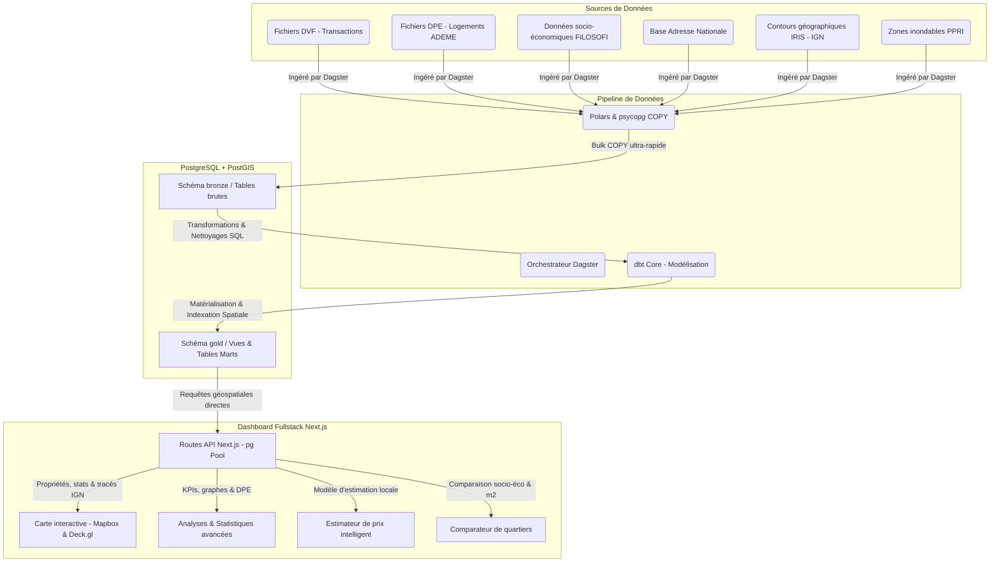

# French Real Estate Market Analysis (BI Project)

**Auteurs : Nathan AVENEL et Adrien PINEAU**

Ce projet de Business Intelligence (BI) immobilier permet de répondre à la problématique :
**"Étant donné un prix, une localisation et des caractéristiques, est-ce une bonne affaire immobilière ?"**

## 🏗️ Architecture ELT



## 🛠️ Technologies Utilisées

- **Base de données** : **PostgreSQL** avec l'extension **PostGIS** pour gérer les requêtes et les jointures spatiales ultra-performantes.
- **Orchestration** : **Dagster** pour coordonner les téléchargements de données brutes et automatiser le pipeline.
- **Traitement de données (Ingestion)** : **Polars** couplé à `psycopg` (Bulk COPY) pour parser et insérer des millions de lignes CSV en quelques secondes de manière ultra-optimisée.
- **Transformation (ELT)** : **dbt Core** pour modéliser, nettoyer et transformer les données brutes (couche Bronze) en tables analytiques prêtes à être requêtées (couche Gold).
- **Frontend & Backend Web (Fullstack)** : **Next.js** (React / Node.js). Utilisé comme framework fullstack à la fois pour le rendu du dashboard interactif (Frontend) ET pour les routes API Serverless interrogeant la base de données (Backend).
- **Cartographie** : **Mapbox GL** / **Deck.gl** (ou React Map GL) pour le rendu visuel interactif des polygones de communes et des points DVF directement dans le navigateur.

## ⚙️ Prérequis & Installation

Avant de pouvoir lancer le projet, vous devez installer les dépendances et configurer votre environnement de développement.

### 1. Variables d'environnement (`.env`)
À la racine du projet (et également dans le dossier `dashboard/` sous le nom `.env.local`), créez un fichier pour configurer l'accès à PostgreSQL et à Dagster.
Voici l'exemple de ce que le fichier doit contenir :
```ini
# Base de données PostgreSQL - Variables modulables
DB_HOST=localhost
DB_PORT=5432
DB_USER=postgres
DB_PASSWORD=postgres
DB_NAME=real_estate_db

# Dossier local pour Dagster
DAGSTER_HOME=D:\Votre\Chemin\Vers\Le\Projet\.dagster
```

### 2. Environnement Python (Pipeline)
Le pipeline de données utilise Python. Il faut créer un environnement virtuel et installer les paquets requis (dbt, dagster, polars, etc.) :
```bash
python -m venv .venv
# Activer l'environnement (sous Windows) :
.venv\Scripts\activate
# (ou sous Linux/Mac : source .venv/bin/activate)

# Installer les dépendances
pip install -r data_pipeline/requirements.txt
```

### 3. Dépendances Node.js (Frontend)
Installez les dépendances du Dashboard Next.js :
```bash
cd dashboard
npm install
cd ..
```

## 🚀 Démarrage Rapide : de A à Z

Voici l'ordre exact des commandes à lancer pour initialiser le projet de zéro. Toutes ces commandes s'appuient sur le `Makefile` inclus (assurez-vous d'avoir votre environnement virtuel activé).

### 1. Démarrer la base de données
Lancez le conteneur Docker PostgreSQL (avec PostGIS) en arrière-plan :
```bash
make up
```
*(Pour couper la base de données plus tard, vous pourrez utiliser `make down`)*

### 2. Ingestion des données brutes via Dagster (Couche Bronze)
Démarrez l'interface d'orchestration Dagster :
```bash
make dagster-ui
```
* Ouvrez votre navigateur sur **http://localhost:3001**
* Dans l'onglet "Assets", cliquez sur **Materialize all**
* Dagster va télécharger, traiter via Polars, et insérer toutes les données dans la base PostgreSQL de manière optimisée.

### 3. Transformation des données (Couche Gold via dbt)
Une fois l'ingestion Dagster terminée avec succès, exécutez la transformation dbt. Cette commande va créer des index et matérialiser la table finale prête à l'emploi :
```bash
make dbt-run
```
*(Patientez quelques instants, cette commande effectue des jointures sur des millions de lignes).*

### 4. Lancer le Dashboard interactif
Démarrez le serveur Next.js pour le frontend :
```bash
make dev-front
```
* Ouvrez votre navigateur sur **http://localhost:3000**
* Vous pouvez maintenant explorer la carte, filtrer par DPE, rechercher des communes et voir les géométries dynamiques se charger en temps réel !

---

## 🌟 Fonctionnalités du Dashboard

Le dashboard interactif regroupe plusieurs modules analytiques indispensables :

1. **🗺️ Carte Interactive (DVF & Risques) :**
   * Affichage des ventes immobilières sous forme de points précis avec un code couleur représentant l'étiquette DPE du logement.
   * Rendu dynamique en temps réel des parcelles cadastrales (IGN ApiCarto) et des zones de risques inondables (PPRI) lors du zoom.
   * Navigation par commune et affichage des fiches détaillées des biens.

2. **📊 Analyses & Statistiques Avancées :**
   * **KPIs Globaux :** Suivi du volume de transactions, du prix médian au m², de la surface habitable moyenne et du pourcentage de logements diagnostiqués.
   * **Évolution Temporelle :** Graphe historique de l'évolution trimestrielle des prix médians par type de bien (Maison vs Appartement).
   * **Énergie :** Graphique de répartition des étiquettes de performance énergétique (DPE).
   * **Distribution des Prix :** Histogramme des prix de vente au m².

3. **🔮 Estimateur de Prix Intelligent :**
   * Saisie des caractéristiques d'un bien (surface, pièces, DPE, type de bien).
   * Calcul d'une estimation personnalisée basée sur les ventes réelles de la base DVF dans le même quartier (code IRIS) et la même commune.
   * Indication de l'impact énergétique (DPE) et des revenus médians locaux (INSEE) sur la valeur estimée.

4. **⚖️ Comparateur de Territoires :**
   * Outil permettant de comparer deux quartiers (IRIS) ou deux communes côte à côte.
   * Analyse comparative des indicateurs de prix au m², de la structure des types de biens vendus, et des caractéristiques socio-économiques INSEE (revenu médian local, taux de pauvreté).

---

## 📂 Sources de données

1. **DVF (Demandes de Valeurs Foncières)** : Historique des transactions immobilières en France (static.data.gouv.fr).
   🔗 [Consulter et télécharger les données (data.gouv.fr)](https://www.data.gouv.fr/fr/datasets/demandes-de-valeurs-foncieres/)
2. **DPE (Diagnostic de Performance Énergétique)** : Données énergétiques de l'ADEME (data.ademe.fr).
   🔗 [Consulter l'API et les données (data.ademe.fr)](https://data.ademe.fr/datasets/dpe-v2-logements-existants)
3. **FILOSOFI (INSEE)** : Données socio-économiques locales (Population, Revenu médian, etc.).
   🔗 [Consulter les données (insee.fr)](https://www.insee.fr/fr/statistiques/8287313)
4. **Communes de France (Etalab/IGN)** : Géométries simplifiées des communes pour l'affichage cartographique (Admin Express).
   🔗 [Dépôt GitHub France GeoJSON](https://github.com/gregoiredavid/france-geojson)
5. **BAN (Base Adresse Nationale)** : Base officielle des adresses françaises utilisée pour la vérification de la géolocalisation.
   🔗 [Télécharger les fichiers CSV (adresse.data.gouv.fr)](https://adresse.data.gouv.fr/donnees-nationales)
